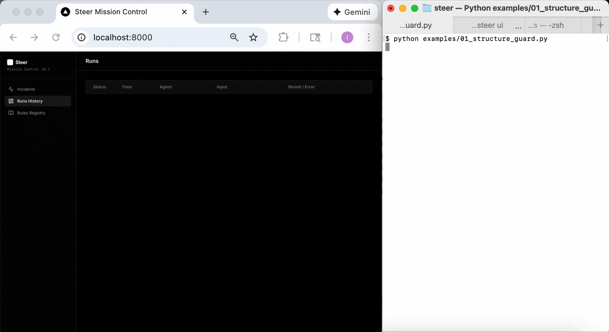

# ⚡ Steer
### The Active Reliability Layer for AI Agents.

**Stop debugging. Start teaching.**  
Steer is an open-source SDK that turns runtime failures into permanent fixes.

Most reliability tools just **log** errors and send you an alert.  
**Steer intercepts the error, lets you "Teach" the agent the correct behavior, and fixes it instantly.**

[](https://badge.fury.io/py/steer-sdk)

---

## 🛑 The Problem: Logging isn't Enough

When an agent fails in production (e.g., outputs bad JSON or leaks PII), seeing a log doesn't help the user who just got a crash. You have to:
1.  Dig through logs.
2.  Reproduce the prompt.
3.  Edit your prompt template.
4.  Redeploy.

**Steer creates a "Teaching Layer" around your agent.** You catch the failure in real-time, provide a correction in the UI, and Steer injects that "memory" into the agent immediately—no code changes required.

---

## ⚡ The Teaching Loop: Catch → Teach → Fix

Steer provides a Human-in-the-Loop workflow to fix "Confident Idiot" agents.

### 1. Catch (The Guard)
Steer wraps your agent and blocks bad outputs *before* they reach the user.



```text
[Steer] 🤖 Agent generating profile...
[Steer] 🚨 BLOCKED: Structure Guard (Detected Markdown wrapping).
[Steer] 🛡️ Execution halted.
```

### 2. Teach (The Fix)
Instead of editing code, go to **Steer Mission Control**.
*   Click the blocked incident.
*   Click **"Teach"**.
*   Select the fix (e.g., **"Strict JSON Mode"**).

*Steer now remembers this rule for this agent.*

### 3. Fix (The Result)
Run the agent again. Steer automatically injects your teaching instruction. The agent self-corrects.

```text
[Steer] 🧠 Context loaded: "Strict JSON" rule found. Applying fix...
[Steer] ✅ SUCCESS: Agent output valid JSON.
```

---

## 🛡️ Supported Guardrails

Steer comes with 3 "Teach-Ready" verifiers out of the box:

| Verifier | The Problem | The "Teaching" Fix |
| :--- | :--- | :--- |
| **JsonVerifier** | Agent wraps code in \`\`\`json blocks | **"Force JSON"**: Inject system instruction to output raw JSON only. |
| **RegexVerifier** | Agent leaks PII (Emails/Keys) | **"Redact PII"**: Force agent to replace sensitive patterns with [REDACTED]. |
| **AmbiguityVerifier** | Agent guesses ambiguous answers | **"Ask Clarification"**: Force agent to ask user questions if >3 results found. |

---

## 🔮 Roadmap: From Verification to Learning

Steer v0.1 provides the "Fast Path" (Runtime Guardrails + Human Teaching).
Steer v0.2+ will introduce the "Slow Path" (Automated Model Improvement).

**Coming Soon:**

*   **Query by Committee:** Automated consensus checks for ambiguous prompts.
*   **Automated Fine-Tuning:** A pipeline to turn your accumulated (Incident -> Fix) logs into a fine-tuned model that stops making those mistakes entirely.
*   **CI/CD Integration:** Block Pull Requests if an agent fails a reliability test suite.

---

## 📦 Installation

```bash
pip install steer-sdk
```

## ⚡ Quickstart

The fastest way to experience the **Teaching Loop** is to generate the interactive examples.

### 1. Generate Demos
Run this in your terminal to create 3 example agents:
```bash
steer init
```

*> Created 01_structure_guard.py*

*> Created 02_safety_guard.py*

*> Created 03_logic_guard.py*

### 2. Run & Fail
Run the Structure Guard demo. It will fail on purpose.
```bash
python 01_structure_guard.py
# 🚨 BLOCKED: Detected Markdown code blocks.
```

### 3. Teach the Agent
Open the dashboard.
```bash
steer ui
```
*   Go to **http://localhost:8000**
*   Click **Teach** on the active incident.
*   Select **"Strict JSON Mode"** and save.

### 4. Run & Succeed
Run the script again. The agent detects the new rule and fixes itself.
```bash
python 01_structure_guard.py
# 🧠 Context loaded: Rules found! Applying fix...
# ✅ SUCCESS: Agent output valid JSON.
```

---

## 🛠️ Integration

To add Steer to your own existing agent:

```python
from steer import capture, get_context
from steer.verifiers import JsonVerifier

# 1. Define Verifiers
json_check = JsonVerifier(name="Strict JSON")

# 2. Decorate your Agent Function
@capture(verifiers=[json_check])
def my_agent(user_input):
    
    # 3. (Optional) Inject Teaching Context
    # This allows the agent to read rules you added in the Dashboard
    teaching_context = get_context("my_agent_name")
    
    # ... Your LLM call (pass teaching_context to system prompt) ...
    return llm_response
```

## 🔑 Configuration (Optional)

The Quickstart demos run locally and require **no API keys**.

To use advanced LLM-based verifiers (like `FactConsistencyVerifier`), set your keys:
```bash
export GEMINI_API_KEY=AIzaSy...
# OR
export OPENAI_API_KEY=sk-...
```
```